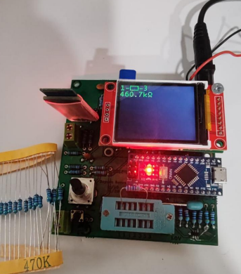
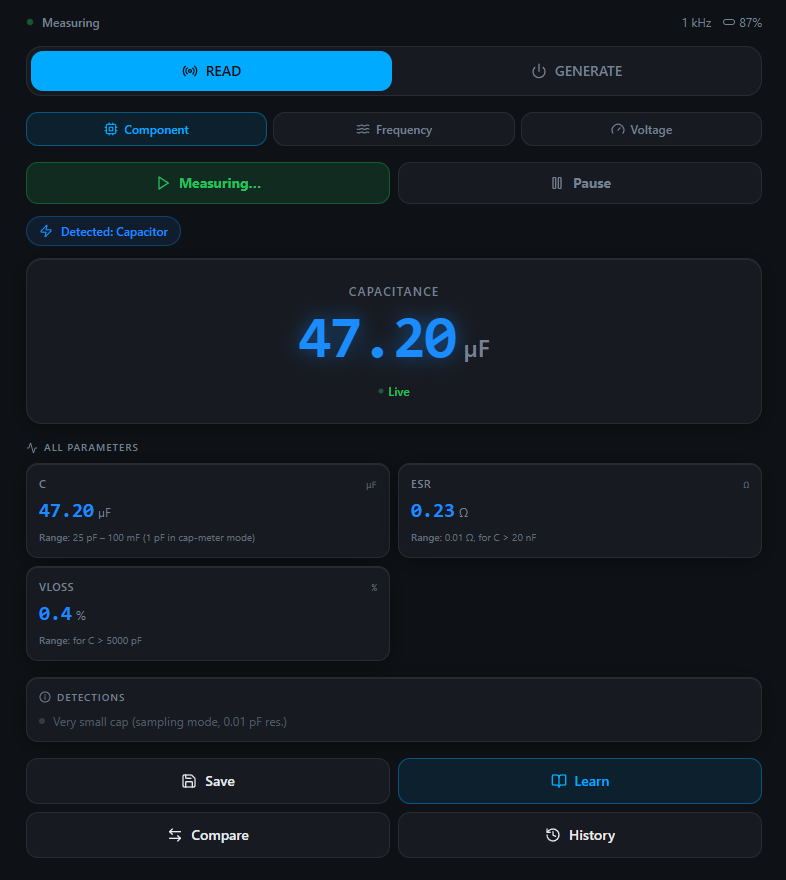
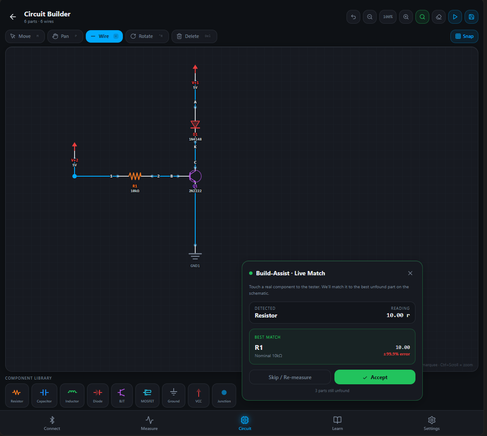
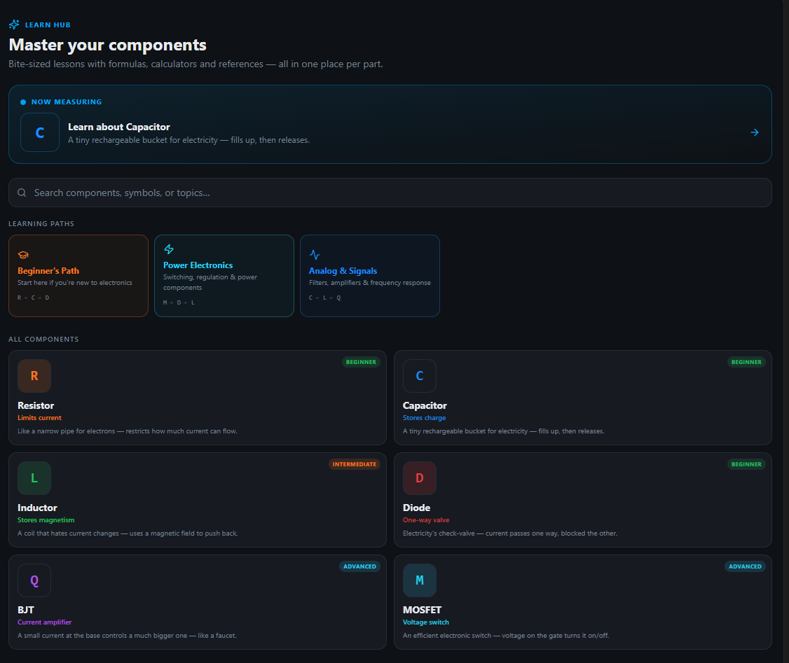

# Smart LCR Lab

**Embedded Hardware Tester + Mobile Companion App**

---

## 🚀 Overview

Smart LCR Lab is a custom-built hardware–software system that automatically identifies and measures electronic components — resistors, capacitors, inductors, diodes, BJTs, and MOSFETs — and streams live results to a React web app over Bluetooth Low Energy.

The companion app goes beyond a simple readout: it includes a real-time dashboard, an interactive circuit builder with Hardware-in-the-Loop verification, a signal generator, and a student-facing educational module. A backend server with user accounts enables persistent circuit storage and synchronized measurement history across sessions.

<!-- TODO: Add photo of the physical device here -->


---

## 🧩 The Problem

Standard bench tools leave three key gaps for engineers and students:

- **Unmarked components** — SMD parts and worn labels make identification impossible by sight alone
- **Manual mode-switching** — multimeters require you to pre-select modes, slowing down debug and assembly
- **No educational context** — static readings give no behavioral insight or schematic correlation
- **No persistence** — measurements and circuit designs are lost when the session ends

---

## ✨ Features

### Hardware
- Auto component detection — R, C, L, Diode, BJT, MOSFET
- Three test points (TP1–TP3) with dynamic pin reconfiguration (no analog mux needed)
- Voltage measurement (0–55V via 10:1 divider)
- Frequency measurement
- PWM output with BLE reverse-control
- HM-10 Bluetooth UART bridge
- Rotary encoder menu navigation
- 1.8″ ST7735 TFT LCD display (128×160 px)
- TVS ESD protection (SRV05-4, ±15kV HBM rated)
- Auto power-off circuit (idle timeout, Q1/Q3 transistor latch)
- 9V battery or 12V barrel jack input with auto source selection

### Web App
- Live BLE telemetry dashboard (component, voltage, frequency panels)
- Signal generator — set PWM frequency/duty cycle and push commands back to hardware
- Interactive circuit builder with drag-and-drop, grid snapping, and zoom (0.5×–3×)
- **Hardware-in-the-Loop verification** — measured values matched against your schematic automatically
- Educational Learn module with context-aware component cards
- Save, compare, and review measurement history

### Backend & Accounts
- User registration and login with JWT authentication
- Cloud-persisted circuit projects — save, load, rename, and delete circuits across sessions
- Measurement history stored per user, filterable by component type or circuit
- Circuits can optionally be linked to a measurement session for traceability

See the [Web App](#-web-app) and [Backend](#-backend) sections below for full details.

---

## 🏗️ System Architecture

```
┌─────────────────────────────────────────────────────┐
│                  Hardware Layer                     │
│  ATmega328P → ADC + Pin Reconfiguration → TFT LCD   │
│  9 Sub-circuits designed in KiCad                   │
└──────────────────┬──────────────────────────────────┘
                   │  BLE (HM-10, UART transparent bridge)
                   │  Frame: TYPE,VALUE,UNIT,SECONDARY
                   │  e.g. "RESISTOR,10.0k,Ω,E12"
┌──────────────────▼──────────────────────────────────┐
│                  Web App (React 18 / TS)             │
│  Dashboard · Circuit Builder · Learn · History      │
└──────────────────┬──────────────────────────────────┘
                   │  REST API  (Bearer JWT)
┌──────────────────▼──────────────────────────────────┐
│              Backend (Node.js / Express / TS)        │
│  /api/auth · /api/circuits · /api/measurements      │
└──────────────────┬──────────────────────────────────┘
                   │  Prisma ORM
┌──────────────────▼──────────────────────────────────┐
│           Database (SQLite dev / swappable)          │
│  User · Circuit · Measurement                       │
└─────────────────────────────────────────────────────┘
```

<!-- TODO: Replace with architecture diagram image -->
<!--  -->

---

## ⚙️ How It Works

1. **Insert** a component into TP1–TP3
2. **Auto-detect** — ATmega328P runs detection heuristics (state machine: IDLE → DETECT → MEASURE → TRANSMIT)
3. **Measure** — ADC reads are averaged over 16 samples; external 2.5V/4.096V reference replaces internal 1.1V for higher accuracy
4. **Display** — value shown on TFT LCD with component type and unit
5. **Transmit** — HM-10 sends a typed BLE packet to the mobile app in <500ms
6. **Visualize** — app dashboard categorizes the reading and optionally matches it against your circuit schematic
7. **Persist** — authenticated users have readings saved to the backend and circuits synced across sessions

---

## 🔬 Hardware Architecture

9 functional sub-circuits, all schematic-captured and laid out in KiCad:

| Sub-circuit | Key Parts | Role |
|---|---|---|
| MCU | ATmega328P (Arduino Nano) | 20 assigned pins, runs all firmware |
| Measurement Net | 680Ω / 470kΩ resistor pairs | Low/high range sensing on TP1–TP3 |
| Voltage Reference | 2.5V / 4.096V shunt (U5) | Replaces internal ADC ref for accuracy |
| TVS Protection | SRV05-4 | ESD clamp on all 4 ADC inputs |
| Bluetooth | HM-10 | BLE SPP, UART transparent bridge |
| TFT Display | ST7735 SPI | 1.8″, 128×160 px |
| Rotary Encoder | ENCA/ENCB + push-button | Menu navigation, debounced via C3 |
| Power Supply | SS12D10G5, Schottky, U3 | 9V/12V input → clean 5V rail |
| Auto Power-Off | Q1 PNP / Q3 NPN latch | Idle timeout via BAT_ENABLE firmware pin |

---

## 📏 Measurement Formulas

```
Resistance:   R = 680 × (Vcc − V) / V
Capacitance:  C = −t / (R × ln(1 − V/Vcc))
```

---

## 📊 Experimental Results

Validated against calibrated bench instruments:

| Parameter | Result |
|---|---|
| Resistor accuracy | **±2%** — range 10Ω to 1MΩ |
| Capacitor error | **<5%** — range 100pF to 10mF (room temperature) |
| BJT detection | NPN/PNP type + B/C/E pin assignment — correct for TO-92 |
| MOSFET detection | N/P-channel + Vth within **10%** of datasheet |
| BLE latency | **<500ms** from component insertion to app readout |
| Circuit Builder | 50+ components, no performance degradation at 0.5×–3× zoom |
| Hardware-in-the-Loop match rate | **>95%** for 5% resistors and 10% capacitors |

---

## 🛠️ Tech Stack

| Layer | Technology |
|---|---|
| Firmware | C++ / Arduino IDE (ATmega328P) |
| PCB Design | KiCad |
| Frontend | React 18, TypeScript, Tailwind CSS |
| Connectivity | Web Bluetooth API |
| Backend | Node.js, Express, TypeScript |
| ORM | Prisma |
| Database | SQLite (dev) — swap datasource for PostgreSQL in production |
| Auth | JWT (30-day tokens, bcrypt password hashing) |
| Reporting | PptxGenJS |

---

## 🖥️ Web App

The companion web app has four distinct modules, each accessible from the top navigation. Sign up or log in to enable cloud sync for circuits and measurement history.

---

### 📡 Smart Dashboard

The primary live-view screen. It connects to the device over BLE using the **Web Bluetooth API** and handles two modes:

**Read Mode** — listens to the incoming BLE feed and automatically categorizes each packet into one of three panels:

| Panel | What it shows |
|---|---|
| Component | Identified type (R/C/L/Diode/BJT/MOSFET), measured value, unit, and E-series hint |
| Voltage | Real-time voltage reading from the 0–55V voltmeter channel |
| Frequency | Signal frequency measured at the PWM input |

SI prefix parsing is handled on the app side — the firmware sends `10.0k` instead of `10000` to avoid floating-point precision loss over BLE, and the app parses the prefix on receipt.

**Generate Mode** — reverses the data flow. Instead of reading from hardware, you set a PWM frequency and duty cycle in the UI and the app sends the command back to the Arduino over BLE. The hardware then drives the PWM output accordingly — useful for testing RC filters or driving components under controlled conditions.

**History & Compare** — every reading can be saved with a single tap. Authenticated users have readings persisted to the backend (up to 200 most recent, filterable by type or circuit). Saved readings appear in a history list where you can compare batches (e.g., testing a reel of resistors for consistency) or review previous sessions.

<!-- TODO: Add dashboard screenshot -->


---

### 🔬 Circuit Builder

A schematic-style canvas for designing circuits digitally and verifying them against physical components.

**Drag & Drop Canvas**
- Place resistors, capacitors, inductors, diodes, BJTs, and MOSFETs onto a grid-snapping canvas
- Wire components together to build schematics
- Supports 50+ simultaneously placed parts with no performance degradation
- Zoom from 0.5× to 3× with correct snap and routing at all levels

**Cloud Circuit Storage** — authenticated users can save named circuit projects to the backend. The canvas state (components, wires, and junctions) is serialized and stored per user. Duplicate names are handled automatically with a counter suffix (e.g. `My Circuit (2)`). The toolbar exposes Save, Load, and Delete actions backed by the Circuits API.

**Hardware-in-the-Loop Verification**
This is the feature that sets the circuit builder apart from a regular schematic editor. When you measure a physical component with the device, the BLE payload is forwarded to the builder. A *Best Match* algorithm compares the measured value against every unverified component in your schematic and surfaces the closest match. You then **Accept** or **Reject** the suggestion.

```
Physical resistor measured → "10.2kΩ"
Schematic has R3 = 10kΩ (5% tolerance)
→ App prompts: "R3 match — 10.2kΩ (Δ +2.0%)" → Accept ✓
```

This bridges the gap between a paper schematic and a physical build, giving you confidence that every component on the board is the right value before powering up.

> Match rate: **>95%** for 5% resistors and 10% capacitors

<!-- TODO: Add circuit builder screenshot -->


---

### 📚 Learn Module

A built-in educational reference that turns the tester into a learning tool, aimed at ECE students encountering unfamiliar components.

**Context-aware triggering** — when a measurement is taken, the Learn module automatically surfaces the card for that component type. No manual searching needed.

**Each component card includes:**
- A plain-English one-liner for instant intuition  
  *e.g. "A coil that hates current changes — uses a magnetic field to push back."*
- The standard schematic symbol
- Typical functional value ranges
- Behavioral notes (how it responds to DC/AC, common failure modes)

**Difficulty tiers** — components are organized into Beginner, Intermediate, and Advanced paths, so students can work through them progressively rather than being overwhelmed by specs upfront.

<!-- TODO: Add Learn module screenshot -->


---

## 🗄️ Backend

The backend lives in `server/` and is a Node.js + Express REST API written in TypeScript. It uses **Prisma** as the ORM and ships with a SQLite database for development; switching to PostgreSQL (or any other Prisma-supported database) requires only a one-line datasource change in `schema.prisma`.

### Authentication

Passwords are hashed with **bcrypt** (12 rounds). On successful register or login the server returns a signed **JWT** (30-day expiry) which the frontend stores in `localStorage` and attaches as a `Bearer` token on every subsequent request. The `requireAuth` middleware validates the token and injects `userId` into the request for downstream route handlers.

| Endpoint | Method | Description |
|---|---|---|
| `/api/auth/register` | POST | Create a new account — body: `{ email, password }` (min 8 chars) |
| `/api/auth/login` | POST | Authenticate — returns `{ token, user }` |
| `/api/health` | GET | Server health check |

### Circuits API

All routes require a valid Bearer token. Each circuit stores its canvas state as three separate JSON blobs (`components`, `wires`, `junctions`) serialized to strings in the database. The API deserializes them before responding so the frontend always receives parsed arrays. Duplicate circuit names per user are resolved automatically with a `(2)`, `(3)` … counter suffix.

| Endpoint | Method | Description |
|---|---|---|
| `/api/circuits` | GET | List all circuits for the current user (id, name, timestamps — no canvas data) |
| `/api/circuits/:id` | GET | Get one circuit with full canvas data |
| `/api/circuits` | POST | Create a new circuit — body: `{ name?, components?, wires?, junctions? }` |
| `/api/circuits/:id` | PUT | Update name and/or canvas data (partial updates supported) |
| `/api/circuits/:id` | DELETE | Delete a circuit (204 No Content) |

### Measurements API

All routes require a valid Bearer token. Results are capped at **200 most recent** entries and can be filtered by component type or associated circuit. A measurement can optionally be linked to a circuit via `circuitId` for traceability (e.g. "all resistors measured during verification of Circuit X").

| Endpoint | Method | Description |
|---|---|---|
| `/api/measurements` | GET | List measurements — optional query params: `?type=resistor`, `?circuitId=<id>` |
| `/api/measurements` | POST | Save a BLE reading — body: `{ type?, values?, pinOrder?, signalFrequency?, externalVoltage?, circuitId? }` |

---

## 🗃️ Database Schema

Managed by **Prisma**. The schema is in `server/prisma/schema.prisma`.

```prisma
model User {
  id           String        @id @default(cuid())
  email        String        @unique
  passwordHash String
  createdAt    DateTime      @default(now())

  circuits     Circuit[]
  measurements Measurement[]
}

model Circuit {
  id         String   @id @default(cuid())
  userId     String
  name       String   @default("Untitled circuit")

  // Canvas state — serialised JSON, stored as String in SQLite
  components String   @default("[]")
  wires      String   @default("[]")
  junctions  String   @default("[]")

  createdAt  DateTime @default(now())
  updatedAt  DateTime @updatedAt

  user         User          @relation(fields: [userId], references: [id], onDelete: Cascade)
  measurements Measurement[]
}

model Measurement {
  id              String   @id @default(cuid())
  userId          String
  circuitId       String?  // optional link to a Circuit

  type            String?  // e.g. "resistor", "capacitor"
  values          String?  // JSON string, e.g. '{"r":"10.0k"}'
  pinOrder        String?  // e.g. "123=BCE" for BJTs
  signalFrequency Float?
  externalVoltage Float?

  timestamp DateTime @default(now())

  user    User     @relation(fields: [userId], references: [id], onDelete: Cascade)
  circuit Circuit? @relation(fields: [circuitId], references: [id], onDelete: SetNull)
}
```

---

## ⚙️ Getting Started

### Prerequisites
- Node.js 18+
- A Chromium-based browser (required for Web Bluetooth API)

### Backend
```bash
cd server
cp .env.example .env        # edit JWT_SECRET and DATABASE_URL if needed
npm install
npm run db:push             # creates the SQLite database and applies the schema
npm run dev                 # starts on http://localhost:3001
```

### Frontend
```bash
npm install
npm run dev                 # starts on http://localhost:5173
```

Open `http://localhost:5173`, register an account, enable Bluetooth, and pair with the HM-10 module on the device.

### Environment Variables (`server/.env`)

| Variable | Default | Description |
|---|---|---|
| `DATABASE_URL` | `file:./prisma/dev.db` | Prisma database connection string |
| `JWT_SECRET` | *(set in .env)* | Secret used to sign JWTs — change before deploying |
| `PORT` | `3001` | Port the Express server listens on |
| `FRONTEND_URL` | `http://localhost:5173` | Allowed origin for CORS |

### Switching to PostgreSQL

Change the datasource block in `server/prisma/schema.prisma`:

```prisma
datasource db {
  provider = "postgresql"
  url      = env("DATABASE_URL")
}
```

Then update `DATABASE_URL` in `.env` to a PostgreSQL connection string and re-run `npm run db:push`.

### Hardware
Flash `firmware/smart_lcr_lab.ino` to the Arduino Nano via Arduino IDE. Ensure baud rate matches the HM-10 configuration (default: 9600).

---

## 🚧 Future Work

- Native mobile app (offline support)
- OAuth login (Google, GitHub)
- True inductance measurement via AC signal injection
- Circuit simulator mode (beyond schematic editor)
- Push-pull PWM driver for hardware output
- DC power supply with current limiter
- On-device AI fault diagnosis from measurement deviations

---

## 👥 Authors

**Mohanned Hossam Issa** · **Abdelrhman Alaa**
